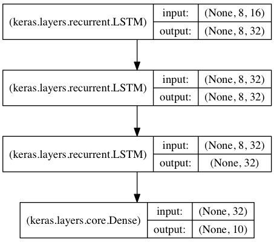

#快速开始序贯（Sequential）模型

序贯模型是多个网络层的线性堆叠，也就是“一条路走到黑”。

可以通过向```Sequential```模型传递一个layer的list来构造该模型：

```python
from keras.models import Sequential
from keras.layers import Dense, Activation

model = Sequential([
Dense(32, units=784),
Activation('relu'),
Dense(10),
Activation('softmax'),
])
```

也可以通过```.add()```方法一个个的将layer加入模型中：

```python
model = Sequential()
model.add(Dense(32, input_shape=(784,)))
model.add(Activation('relu'))
```

***
	
## 指定输入数据的shape

模型需要知道输入数据的shape，因此，```Sequential```的第一层需要接受一个关于输入数据shape的参数，后面的各个层则可以自动的推导出中间数据的shape，因此不需要为每个层都指定这个参数。有几种方法来为第一层指定输入数据的shape

* 传递一个```input_shape```的关键字参数给第一层，```input_shape```是一个tuple类型的数据，其中也可以填入```None```，如果填入```None```则表示此位置可能是任何正整数。数据的batch大小不应包含在其中。

* 有些2D层，如```Dense```，支持通过指定其输入维度```input_dim```来隐含的指定输入数据shape,是一个Int类型的数据。一些3D的时域层支持通过参数```input_dim```和```input_length```来指定输入shape。

* 如果你需要为输入指定一个固定大小的batch_size（常用于stateful RNN网络），可以传递```batch_size```参数到一个层中，例如你想指定输入张量的batch大小是32，数据shape是（6，8），则你需要传递```batch_size=32```和```input_shape=(6,8)```。


```python
model = Sequential()
model.add(Dense(32, input_dim=784))
```
```python
model = Sequential()
model.add(Dense(32, input_shape=(784,)))
```

***

## 编译

在训练模型之前，我们需要通过```compile```来对学习过程进行配置。```compile```接收三个参数：

* 优化器optimizer：该参数可指定为已预定义的优化器名，如```rmsprop```、```adagrad```，或一个```Optimizer```类的对象，详情见[optimizers](../other/optimizers.md)

* 损失函数loss：该参数为模型试图最小化的目标函数，它可为预定义的损失函数名，如```categorical_crossentropy```、```mse```，也可以为一个损失函数。详情见[losses](../other/objectives.md)

* 指标列表metrics：对分类问题，我们一般将该列表设置为```metrics=['accuracy']```。指标可以是一个预定义指标的名字,也可以是一个用户定制的函数.指标函数应该返回单个张量,或一个完成`metric_name - > metric_value`映射的字典.请参考[性能评估](../other/metrices.md)
	

```python
# For a multi-class classification problem
model.compile(optimizer='rmsprop',
              loss='categorical_crossentropy',
              metrics=['accuracy'])

# For a binary classification problem
model.compile(optimizer='rmsprop',
              loss='binary_crossentropy',
              metrics=['accuracy'])

# For a mean squared error regression problem
model.compile(optimizer='rmsprop',
              loss='mse')

# For custom metrics
import keras.backend as K

def mean_pred(y_true, y_pred):
    return K.mean(y_pred)

model.compile(optimizer='rmsprop',
              loss='binary_crossentropy',
              metrics=['accuracy', mean_pred])
```

***

## 训练

Keras以Numpy数组作为输入数据和标签的数据类型。训练模型一般使用```fit```函数，该函数的详情见[这里](../models/sequential.md)。下面是一些例子。

```python
# For a single-input model with 2 classes (binary classification):

model = Sequential()
model.add(Dense(32, activation='relu', input_dim=100))
model.add(Dense(1, activation='sigmoid'))
model.compile(optimizer='rmsprop',
              loss='binary_crossentropy',
              metrics=['accuracy'])

# Generate dummy data
import numpy as np
data = np.random.random((1000, 100))
labels = np.random.randint(2, size=(1000, 1))

# Train the model, iterating on the data in batches of 32 samples
model.fit(data, labels, epochs=10, batch_size=32)
```

```python
# For a single-input model with 10 classes (categorical classification):

model = Sequential()
model.add(Dense(32, activation='relu', input_dim=100))
model.add(Dense(10, activation='softmax'))
model.compile(optimizer='rmsprop',
              loss='categorical_crossentropy',
              metrics=['accuracy'])

# Generate dummy data
import numpy as np
data = np.random.random((1000, 100))
labels = np.random.randint(10, size=(1000, 1))

# Convert labels to categorical one-hot encoding
one_hot_labels = keras.utils.to_categorical(labels, num_classes=10)

# Train the model, iterating on the data in batches of 32 samples
model.fit(data, one_hot_labels, epochs=10, batch_size=32)
```

***

## 例子

这里是一些帮助你开始的例子

在Keras代码包的examples文件夹中，你将找到使用真实数据的示例模型：

* CIFAR10 小图片分类：使用CNN和实时数据提升
* IMDB 电影评论观点分类：使用LSTM处理成序列的词语
* Reuters（路透社）新闻主题分类：使用多层感知器（MLP）
* MNIST手写数字识别：使用多层感知器和CNN
* 字符级文本生成：使用LSTM
...

### 基于多层感知器的softmax多分类：

```python
from keras.models import Sequential
from keras.layers import Dense, Dropout, Activation
from keras.optimizers import SGD

# Generate dummy data
import numpy as np
x_train = np.random.random((1000, 20))
y_train = keras.utils.to_categorical(np.random.randint(10, size=(1000, 1)), num_classes=10)
x_test = np.random.random((100, 20))
y_test = keras.utils.to_categorical(np.random.randint(10, size=(100, 1)), num_classes=10)

model = Sequential()
# Dense(64) is a fully-connected layer with 64 hidden units.
# in the first layer, you must specify the expected input data shape:
# here, 20-dimensional vectors.
model.add(Dense(64, activation='relu', input_dim=20))
model.add(Dropout(0.5))
model.add(Dense(64, activation='relu'))
model.add(Dropout(0.5))
model.add(Dense(10, activation='softmax'))

sgd = SGD(lr=0.01, decay=1e-6, momentum=0.9, nesterov=True)
model.compile(loss='categorical_crossentropy',
              optimizer=sgd,
              metrics=['accuracy'])

model.fit(x_train, y_train,
          epochs=20,
          batch_size=128)
score = model.evaluate(x_test, y_test, batch_size=128)
```

### MLP的二分类：

```python	
import numpy as np
from keras.models import Sequential
from keras.layers import Dense, Dropout

# Generate dummy data
x_train = np.random.random((1000, 20))
y_train = np.random.randint(2, size=(1000, 1))
x_test = np.random.random((100, 20))
y_test = np.random.randint(2, size=(100, 1))

model = Sequential()
model.add(Dense(64, input_dim=20, activation='relu'))
model.add(Dropout(0.5))
model.add(Dense(64, activation='relu'))
model.add(Dropout(0.5))
model.add(Dense(1, activation='sigmoid'))

model.compile(loss='binary_crossentropy',
              optimizer='rmsprop',
              metrics=['accuracy'])
model.fit(x_train, y_train,
          epochs=20,
          batch_size=128)
score = model.evaluate(x_test, y_test, batch_size=128)
```


### 类似VGG的卷积神经网络：

```python
import numpy as np
import keras
from keras.models import Sequential
from keras.layers import Dense, Dropout, Flatten
from keras.layers import Conv2D, MaxPooling2D
from keras.optimizers import SGD

# Generate dummy data
x_train = np.random.random((100, 100, 100, 3))
y_train = keras.utils.to_categorical(np.random.randint(10, size=(100, 1)), num_classes=10)
x_test = np.random.random((20, 100, 100, 3))
y_test = keras.utils.to_categorical(np.random.randint(10, size=(20, 1)), num_classes=10)

model = Sequential()
# input: 100x100 images with 3 channels -> (100, 100, 3) tensors.
# this applies 32 convolution filters of size 3x3 each.
model.add(Conv2D(32, (3, 3), activation='relu', input_shape=(100, 100, 3)))
model.add(Conv2D(32, (3, 3), activation='relu'))
model.add(MaxPooling2D(pool_size=(2, 2)))
model.add(Dropout(0.25))

model.add(Conv2D(64, (3, 3), activation='relu'))
model.add(Conv2D(64, (3, 3), activation='relu'))
model.add(MaxPooling2D(pool_size=(2, 2)))
model.add(Dropout(0.25))

model.add(Flatten())
model.add(Dense(256, activation='relu'))
model.add(Dropout(0.5))
model.add(Dense(10, activation='softmax'))

sgd = SGD(lr=0.01, decay=1e-6, momentum=0.9, nesterov=True)
model.compile(loss='categorical_crossentropy', optimizer=sgd)

model.fit(x_train, y_train, batch_size=32, epochs=10)
score = model.evaluate(x_test, y_test, batch_size=32)
```

	
### 使用LSTM的序列分类

```python
from keras.models import Sequential
from keras.layers import Dense, Dropout
from keras.layers import Embedding
from keras.layers import LSTM

model = Sequential()
model.add(Embedding(max_features, output_dim=256))
model.add(LSTM(128))
model.add(Dropout(0.5))
model.add(Dense(1, activation='sigmoid'))

model.compile(loss='binary_crossentropy',
              optimizer='rmsprop',
              metrics=['accuracy'])

model.fit(x_train, y_train, batch_size=16, epochs=10)
score = model.evaluate(x_test, y_test, batch_size=16)
```

### 使用1D卷积的序列分类

```python
from keras.models import Sequential
from keras.layers import Dense, Dropout
from keras.layers import Embedding
from keras.layers import Conv1D, GlobalAveragePooling1D, MaxPooling1D

model = Sequential()
model.add(Conv1D(64, 3, activation='relu', input_shape=(seq_length, 100)))
model.add(Conv1D(64, 3, activation='relu'))
model.add(MaxPooling1D(3))
model.add(Conv1D(128, 3, activation='relu'))
model.add(Conv1D(128, 3, activation='relu'))
model.add(GlobalAveragePooling1D())
model.add(Dropout(0.5))
model.add(Dense(1, activation='sigmoid'))

model.compile(loss='binary_crossentropy',
              optimizer='rmsprop',
              metrics=['accuracy'])

model.fit(x_train, y_train, batch_size=16, epochs=10)
score = model.evaluate(x_test, y_test, batch_size=16)
```

	
### 用于序列分类的栈式LSTM

在该模型中，我们将三个LSTM堆叠在一起，是该模型能够学习更高层次的时域特征表示。

开始的两层LSTM返回其全部输出序列，而第三层LSTM只返回其输出序列的最后一步结果，从而其时域维度降低（即将输入序列转换为单个向量）



```python
from keras.models import Sequential
from keras.layers import LSTM, Dense
import numpy as np

data_dim = 16
timesteps = 8
num_classes = 10

# expected input data shape: (batch_size, timesteps, data_dim)
model = Sequential()
model.add(LSTM(32, return_sequences=True,
               input_shape=(timesteps, data_dim)))  # returns a sequence of vectors of dimension 32
model.add(LSTM(32, return_sequences=True))  # returns a sequence of vectors of dimension 32
model.add(LSTM(32))  # return a single vector of dimension 32
model.add(Dense(10, activation='softmax'))

model.compile(loss='categorical_crossentropy',
              optimizer='rmsprop',
              metrics=['accuracy'])

# Generate dummy training data
x_train = np.random.random((1000, timesteps, data_dim))
y_train = np.random.random((1000, num_classes))

# Generate dummy validation data
x_val = np.random.random((100, timesteps, data_dim))
y_val = np.random.random((100, num_classes))

model.fit(x_train, y_train,
          batch_size=64, epochs=5,
          validation_data=(x_val, y_val))
```
			  
### 采用stateful LSTM的相同模型

stateful LSTM的特点是，在处理过一个batch的训练数据后，其内部状态（记忆）会被作为下一个batch的训练数据的初始状态。状态LSTM使得我们可以在合理的计算复杂度内处理较长序列

请FAQ中关于[stateful LSTM](../for_beginners/FAQ.md)的部分获取更多信息

```python
from keras.models import Sequential
from keras.layers import LSTM, Dense
import numpy as np

data_dim = 16
timesteps = 8
num_classes = 10
batch_size = 32

# Expected input batch shape: (batch_size, timesteps, data_dim)
# Note that we have to provide the full batch_input_shape since the network is stateful.
# the sample of index i in batch k is the follow-up for the sample i in batch k-1.
model = Sequential()
model.add(LSTM(32, return_sequences=True, stateful=True,
               batch_input_shape=(batch_size, timesteps, data_dim)))
model.add(LSTM(32, return_sequences=True, stateful=True))
model.add(LSTM(32, stateful=True))
model.add(Dense(10, activation='softmax'))

model.compile(loss='categorical_crossentropy',
              optimizer='rmsprop',
              metrics=['accuracy'])

# Generate dummy training data
x_train = np.random.random((batch_size * 10, timesteps, data_dim))
y_train = np.random.random((batch_size * 10, num_classes))

# Generate dummy validation data
x_val = np.random.random((batch_size * 3, timesteps, data_dim))
y_val = np.random.random((batch_size * 3, num_classes))

model.fit(x_train, y_train,
          batch_size=batch_size, epochs=5, shuffle=False,
          validation_data=(x_val, y_val))
```
