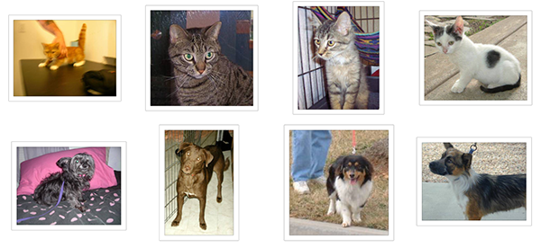

# 面向小数据集构建图像分类模型

##文章信息

本文地址：[<font color="#FF0000">http://blog.keras.io/building-powerful-image-classification-models-using-very-little-data.html</font>](http://blog.keras.io/building-powerful-image-classification-models-using-very-little-data.html)

本文作者：Francois Chollet

### 概述

在本文中，我们将提供一些面向小数据集（几百张到几千张图片）构造高效、实用的图像分类器的方法。

本文将探讨如下几种方法：

* 从图片中直接训练一个小网络（作为基准方法）

* 利用预训练网络的bottleneck（瓶颈）特征

* fine-tune预训练网络的高层

本文需要使用的Keras模块有：

* ```fit_generator```：用于从Python生成器中训练网络

* ```ImageDataGenerator```：用于实时数据提升

* 层参数冻结和模型fine-tune

***

### 配置情况

我们的实验基于下面的配置

* 2000张训练图片构成的数据集，一共两个类别，每类1000张

* 安装有Keras，SciPy，PIL的机器，如果有NVIDIA GPU那就更好了，但因为我们面对的是小数据集，没有也可以。

* 数据集按照下面的形式存放

```bash
data/
	train/
		dogs/
			dog001.jpg
			dog002.jpg
			...
		cats/
			cat001/jpg
			cat002.jpg
			...
	validation/
		dogs/
			dog001.jpg
			dog002.jpg
			...
		cats/
			cat001/jpg
			cat002.jpg
			...
```

这份数据集来源于[<font color='#FF0000'>Kaggle</font>](https://www.kaggle.com/c/dogs-vs-cats/data)，原数据集有12500只猫和12500只狗，我们只取了各个类的前1000张图片。另外我们还从各个类中取了400张额外图片用于测试。

下面是数据集的一些示例图片，图片的数量非常少，这对于图像分类来说是个大麻烦。但现实是，很多真实世界图片获取是很困难的，我们能得到的样本数目确实很有限（比如医学图像，每张正样本都意味着一个承受痛苦的病人:(）。对数据科学家而言，我们应该有能够榨取少量数据的全部价值的能力，而不是简单的伸手要更多的数据。



在Kaggle的猫狗大战竞赛种，参赛者通过使用现代的深度学习技术达到了98%的正确率，我们只使用了全部数据的8%，因此这个问题对我们来说更难。

***

### 针对小数据集的深度学习

我经常听到的一种说法是，深度学习只有在你拥有海量数据时才有意义。虽然这种说法并不是完全不对，但却具有较强的误导性。当然，深度学习强调从数据中自动学习特征的能力，没有足够的训练样本，这几乎是不可能的。尤其是当输入的数据维度很高（如图片）时。然而，卷积神经网络作为深度学习的支柱，被设计为针对“感知”问题最好的模型之一（如图像分类问题），即使只有很少的数据，网络也能把特征学的不错。针对小数据集的神经网络依然能够得到合理的结果，并不需要任何手工的特征工程。一言以蔽之，卷积神经网络大法好！

另一方面，深度学习模型天然就具有可重用的特性：比方说，你可以把一个在大规模数据上训练好的图像分类或语音识别的模型重用在另一个很不一样的问题上，而只需要做有限的一点改动。尤其在计算机视觉领域，许多预训练的模型现在都被公开下载，并被重用在其他问题上以提升在小数据集上的性能。

***

### 数据预处理与数据提升

为了尽量利用我们有限的训练数据，我们将通过一系列随机变换堆数据进行提升，这样我们的模型将看不到任何两张完全相同的图片，这有利于我们抑制过拟合，使得模型的泛化能力更好。

在Keras中，这个步骤可以通过```keras.preprocessing.image.ImageGenerator```来实现，这个类使你可以：

* 在训练过程中，设置要施行的随机变换

* 通过```.flow```或```.flow_from_directory(directory)```方法实例化一个针对图像batch的生成器，这些生成器可以被用作keras模型相关方法的输入，如```fit_generator```，```evaluate_generator```和```predict_generator```

现在让我们看个例子：

```python
from keras.preprocessing.image import ImageDataGenerator

datagen = ImageDataGenerator(
        rotation_range=40,
        width_shift_range=0.2,
        height_shift_range=0.2,
        rescale=1./255,
        shear_range=0.2,
        zoom_range=0.2,
        horizontal_flip=True,
        fill_mode='nearest')
```

上面显示的只是一部分选项，请阅读文档的相关部分来查看全部可用的选项。我们来快速的浏览一下这些选项的含义：

* ```rotation_range```是一个0~180的度数，用来指定随机选择图片的角度。

* ```width_shift```和```height_shift```用来指定水平和竖直方向随机移动的程度，这是两个0~1之间的比例。

* ```rescale```值将在执行其他处理前乘到整个图像上，我们的图像在RGB通道都是0~255的整数，这样的操作可能使图像的值过高或过低，所以我们将这个值定为0~1之间的数。

* ```shear_range```是用来进行剪切变换的程度，参考[<font color='#FF0000'>剪切变换</font>](https://en.wikipedia.org/wiki/Shear_mapping)

* ```zoom_range```用来进行随机的放大

* ```horizontal_flip```随机的对图片进行水平翻转，这个参数适用于水平翻转不影响图片语义的时候

* ```fill_mode```用来指定当需要进行像素填充，如旋转，水平和竖直位移时，如何填充新出现的像素

下面我们使用这个工具来生成图片，并将它们保存在一个临时文件夹中，这样我们可以感觉一下数据提升究竟做了什么事。为了使图片能够展示出来，这里没有使用```rescaling```

```python
from keras.preprocessing.image import ImageDataGenerator, array_to_img, img_to_array, load_img

datagen = ImageDataGenerator(
        rotation_range=40,
        width_shift_range=0.2,
        height_shift_range=0.2,
        shear_range=0.2,
        zoom_range=0.2,
        horizontal_flip=True,
        fill_mode='nearest')

img = load_img('data/train/cats/cat.0.jpg')  # this is a PIL image
x = img_to_array(img)  # this is a Numpy array with shape (3, 150, 150)
x = x.reshape((1,) + x.shape)  # this is a Numpy array with shape (1, 3, 150, 150)

# the .flow() command below generates batches of randomly transformed images
# and saves the results to the `preview/` directory
i = 0
for batch in datagen.flow(x, batch_size=1,
                          save_to_dir='preview', save_prefix='cat', save_format='jpeg'):
    i += 1
    if i > 20:
        break  # otherwise the generator would loop indefinitely
```

下面是一张图片被提升以后得到的多个结果：


***

### 在小数据集上训练神经网络：40行代码达到80%的准确率

进行图像分类的正确工具是卷积网络，所以我们来试试用卷积神经网络搭建一个初级的模型。因为我们的样本数很少，所以我们应该对过拟合的问题多加注意。当一个模型从很少的样本中学习到不能推广到新数据的模式时，我们称为出现了过拟合的问题。过拟合发生时，模型试图使用不相关的特征来进行预测。例如，你有三张伐木工人的照片，有三张水手的照片。六张照片中只有一个伐木工人戴了帽子，如果你认为戴帽子是能将伐木工人与水手区别开的特征，那么此时你就是一个差劲的分类器。

数据提升是对抗过拟合问题的一个武器，但还不够，因为提升过的数据仍然是高度相关的。对抗过拟合的你应该主要关注的是模型的“熵容量”——模型允许存储的信息量。能够存储更多信息的模型能够利用更多的特征取得更好的性能，但也有存储不相关特征的风险。另一方面，只能存储少量信息的模型会将存储的特征主要集中在真正相关的特征上，并有更好的泛化性能。

有很多不同的方法来调整模型的“熵容量”，常见的一种选择是调整模型的参数数目，即模型的层数和每层的规模。另一种方法是对权重进行正则化约束，如L1或L2.这种约束会使模型的权重偏向较小的值。

在我们的模型里，我们使用了很小的卷积网络，只有很少的几层，每层的滤波器数目也不多。再加上数据提升和Dropout，就差不多了。Dropout通过防止一层看到两次完全一样的模式来防止过拟合，相当于也是一种数据提升的方法。（你可以说dropout和数据提升都在随机扰乱数据的相关性）

下面展示的代码是我们的第一个模型，一个很简单的3层卷积加上ReLU激活函数，再接max-pooling层。这个结构和Yann LeCun在1990年发布的图像分类器很相似（除了ReLU）

这个实验的全部代码在[<font color="#FF0000">这里</font>](https://gist.github.com/fchollet/0830affa1f7f19fd47b06d4cf89ed44d)

```python
from keras.models import Sequential
from keras.layers import Convolution2D, MaxPooling2D
from keras.layers import Activation, Dropout, Flatten, Dense

model = Sequential()
model.add(Convolution2D(32, 3, 3, input_shape=(3, 150, 150)))
model.add(Activation('relu'))
model.add(MaxPooling2D(pool_size=(2, 2)))

model.add(Convolution2D(32, 3, 3))
model.add(Activation('relu'))
model.add(MaxPooling2D(pool_size=(2, 2)))

model.add(Convolution2D(64, 3, 3))
model.add(Activation('relu'))
model.add(MaxPooling2D(pool_size=(2, 2)))

# the model so far outputs 3D feature maps (height, width, features)
```

然后我们接了两个全连接网络，并以单个神经元和sigmoid激活结束模型。这种选择会产生二分类的结果，与这种配置相适应，我们使用```binary_crossentropy```作为损失函数。

```python
model.add(Flatten())  # this converts our 3D feature maps to 1D feature vectors
model.add(Dense(64))
model.add(Activation('relu'))
model.add(Dropout(0.5))
model.add(Dense(1))
model.add(Activation('sigmoid'))

model.compile(loss='binary_crossentropy',
              optimizer='rmsprop',
              metrics=['accuracy'])
```

然后我们开始准备数据，使用```.flow_from_directory()```来从我们的jpgs图片中直接产生数据和标签。

```python
# this is the augmentation configuration we will use for training
train_datagen = ImageDataGenerator(
        rescale=1./255,
        shear_range=0.2,
        zoom_range=0.2,
        horizontal_flip=True)

# this is the augmentation configuration we will use for testing:
# only rescaling
test_datagen = ImageDataGenerator(rescale=1./255)

# this is a generator that will read pictures found in
# subfolers of 'data/train', and indefinitely generate
# batches of augmented image data
train_generator = train_datagen.flow_from_directory(
        'data/train',  # this is the target directory
        target_size=(150, 150),  # all images will be resized to 150x150
        batch_size=32,
        class_mode='binary')  # since we use binary_crossentropy loss, we need binary labels

# this is a similar generator, for validation data
validation_generator = test_datagen.flow_from_directory(
        'data/validation',
        target_size=(150, 150),
        batch_size=32,
        class_mode='binary')
```

然后我们可以用这个生成器来训练网络了，在GPU上每个epoch耗时20~30秒，在CPU上耗时300~400秒，所以如果你不是很着急，在CPU上跑这个模型也是完全可以的。

```python
model.fit_generator(
        train_generator,
        samples_per_epoch=2000,
        nb_epoch=50,
        validation_data=validation_generator,
        nb_val_samples=800)
model.save_weights('first_try.h5')  # always save your weights after training or during training

```

这个模型在50个epoch后的准确率为79%~81%，别忘了我们只用了8%的数据，也没有花时间来做模型和超参数的优化。在Kaggle中，这个模型已经可以进前100名了（一共215队参与），估计剩下的115队都没有用深度学习:)

注意这个准确率的变化可能会比较大，因为准确率本来就是一个变化较高的评估参数，而且我们只有800个样本用来测试。比较好的验证方法是使用K折交叉验证，但每轮验证中我们都要训练一个模型。

***

### 使用预训练网络的bottleneck特征：一分钟达到90%的正确率

一个稍微讲究一点的办法是，利用在大规模数据集上预训练好的网络。这样的网络在多数的计算机视觉问题上都能取得不错的特征，利用这样的特征可以让我们获得更高的准确率。

我们将使用vgg-16网络，该网络在ImageNet数据集上进行训练，这个模型我们之前提到过了。因为ImageNet数据集包含多种“猫”类和多种“狗”类，这个模型已经能够学习与我们这个数据集相关的特征了。事实上，简单的记录原来网络的输出而不用bottleneck特征就已经足够把我们的问题解决的不错了。不过我们这里讲的方法对其他的类似问题有更好的推广性，包括在ImageNet中没有出现的类别的分类问题。

VGG-16的网络结构如下：


我们的方法是这样的，我们将利用网络的卷积层部分，把全连接以上的部分抛掉。然后在我们的训练集和测试集上跑一遍，将得到的输出（即“bottleneck feature”，网络在全连接之前的最后一层激活的feature map）记录在两个numpy array里。然后我们基于记录下来的特征训练一个全连接网络。

我们将这些特征保存为离线形式，而不是将我们的全连接模型直接加到网络上并冻结之前的层参数进行训练的原因是处于计算效率的考虑。运行VGG网络的代价是非常高昂的，尤其是在CPU上运行，所以我们只想运行一次。这也是我们不进行数据提升的原因。

我们不再赘述如何搭建vgg-16网络了，这件事之前已经说过，在keras的example里也可以找到。但让我们看看如何记录bottleneck特征。

```python
generator = datagen.flow_from_directory(
        'data/train',
        target_size=(150, 150),
        batch_size=32,
        class_mode=None,  # this means our generator will only yield batches of data, no labels
        shuffle=False)  # our data will be in order, so all first 1000 images will be cats, then 1000 dogs
# the predict_generator method returns the output of a model, given
# a generator that yields batches of numpy data
bottleneck_features_train = model.predict_generator(generator, 2000)
# save the output as a Numpy array
np.save(open('bottleneck_features_train.npy', 'w'), bottleneck_features_train)

generator = datagen.flow_from_directory(
        'data/validation',
        target_size=(150, 150),
        batch_size=32,
        class_mode=None,
        shuffle=False)
bottleneck_features_validation = model.predict_generator(generator, 800)
np.save(open('bottleneck_features_validation.npy', 'w'), bottleneck_features_validation)
```

记录完毕后我们可以将数据载入，用于训练我们的全连接网络：

```python
train_data = np.load(open('bottleneck_features_train.npy'))
# the features were saved in order, so recreating the labels is easy
train_labels = np.array([0] * 1000 + [1] * 1000)

validation_data = np.load(open('bottleneck_features_validation.npy'))
validation_labels = np.array([0] * 400 + [1] * 400)

model = Sequential()
model.add(Flatten(input_shape=train_data.shape[1:]))
model.add(Dense(256, activation='relu'))
model.add(Dropout(0.5))
model.add(Dense(1, activation='sigmoid'))

model.compile(optimizer='rmsprop',
              loss='binary_crossentropy',
              metrics=['accuracy'])

model.fit(train_data, train_labels,
          nb_epoch=50, batch_size=32,
          validation_data=(validation_data, validation_labels))
model.save_weights('bottleneck_fc_model.h5')
```

因为特征的size很小，模型在CPU上跑的也会很快，大概1s一个epoch，最后我们的准确率是90%~91%，这么好的结果多半归功于预训练的vgg网络帮助我们提取特征。

***

### 在预训练的网络上fine-tune

为了进一步提高之前的结果，我们可以试着fine-tune网络的后面几层。Fine-tune以一个预训练好的网络为基础，在新的数据集上重新训练一小部分权重。在这个实验中，fine-tune分三个步骤

* 搭建vgg-16并载入权重

* 将之前定义的全连接网络加在模型的顶部，并载入权重

* 冻结vgg16网络的一部分参数


注意：

* 为了进行fine-tune,所有的层都应该以训练好的权重为初始值，例如，你不能将随机初始的全连接放在预训练的卷积层之上，这是因为由随机权重产生的大梯度将会破坏卷积层预训练的权重。在我们的情形中，这就是为什么我们首先训练顶层分类器，然后再基于它进行fine-tune的原因

* 我们选择只fine-tune最后的卷积块，而不是整个网络，这是为了防止过拟合。整个网络具有巨大的熵容量，因此具有很高的过拟合倾向。由底层卷积模块学习到的特征更加一般，更加不具有抽象性，因此我们要保持前两个卷积块（学习一般特征）不动，只fine-tune后面的卷积块（学习特别的特征）。

* fine-tune应该在很低的学习率下进行，通常使用SGD优化而不是其他自适应学习率的优化算法，如RMSProp。这是为了保证更新的幅度保持在较低的程度，以免毁坏预训练的特征。

代码如下，首先在初始化好的vgg网络上添加我们预训练好的模型：
```python
# build a classifier model to put on top of the convolutional model
top_model = Sequential()
top_model.add(Flatten(input_shape=model.output_shape[1:]))
top_model.add(Dense(256, activation='relu'))
top_model.add(Dropout(0.5))
top_model.add(Dense(1, activation='sigmoid'))

# note that it is necessary to start with a fully-trained
# classifier, including the top classifier,
# in order to successfully do fine-tuning
top_model.load_weights(top_model_weights_path)

# add the model on top of the convolutional base
model.add(top_model)
```

然后将最后一个卷积块前的卷积层参数冻结：

```python
# set the first 25 layers (up to the last conv block)
# to non-trainable (weights will not be updated)
for layer in model.layers[:25]:
    layer.trainable = False

# compile the model with a SGD/momentum optimizer
# and a very slow learning rate.
model.compile(loss='binary_crossentropy',
              optimizer=optimizers.SGD(lr=1e-4, momentum=0.9),
              metrics=['accuracy'])
```

然后以很低的学习率进行训练：

```python
# prepare data augmentation configuration
train_datagen = ImageDataGenerator(
        rescale=1./255,
        shear_range=0.2,
        zoom_range=0.2,
        horizontal_flip=True)

test_datagen = ImageDataGenerator(rescale=1./255)

train_generator = train_datagen.flow_from_directory(
        train_data_dir,
        target_size=(img_height, img_width),
        batch_size=32,
        class_mode='binary')

validation_generator = test_datagen.flow_from_directory(
        validation_data_dir,
        target_size=(img_height, img_width),
        batch_size=32,
        class_mode='binary')

# fine-tune the model
model.fit_generator(
        train_generator,
        samples_per_epoch=nb_train_samples,
        nb_epoch=nb_epoch,
        validation_data=validation_generator,
        nb_val_samples=nb_validation_samples)
```

在50个epoch之后该方法的准确率为94%，非常成功

通过下面的方法你可以达到95%以上的正确率：

* 更加强烈的数据提升

* 更加强烈的dropout

* 使用L1和L2正则项（也称为权重衰减）

* fine-tune更多的卷积块（配合更大的正则）


