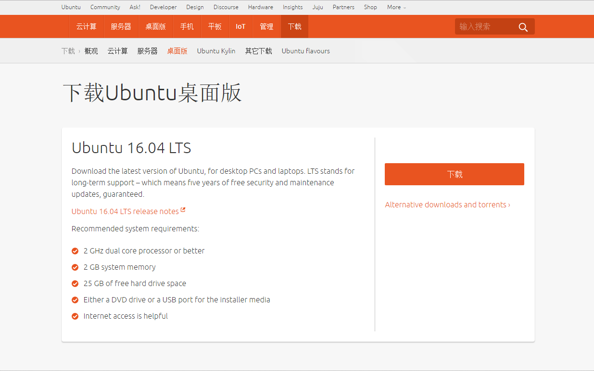
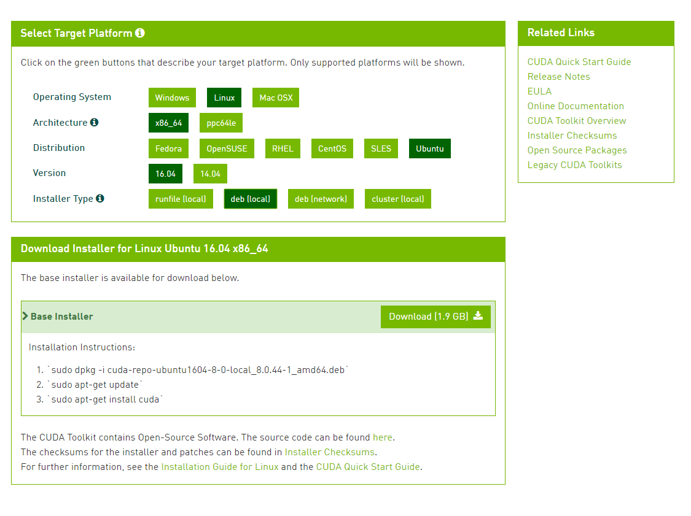

# 声明
**本教程不得用于任何形式的商业用途，如果需要转载请与作者SCP-173联系，如果发现未经允许复制转载，将保留追求其法律责任的权利。**


---
## 关于计算机的硬件配置说明
### 推荐配置
如果您是高校学生或者高级研究人员，并且实验室或者个人资金充沛，建议您采用如下配置：

 - 主板：X99型号或Z170型号
 - CPU：i7-5830K或i7-6700K 及其以上高级型号
 - 内存：品牌内存，总容量32G以上，根据主板组成4通道或8通道
 - SSD：品牌固态硬盘，容量256G以上
 - 显卡：**NVIDIA GTX 1080 Ti、NVIDIA GTX 1080、NVIDIA GTX 1070、NVIDIA GTX 1060 (顺序为优先建议，并且建议同一显卡，可以根据主板插槽数量购买多块，例如X99型号主板最多可以采用×4的显卡)**
 - 电源：由主机机容量的确定，一般有显卡总容量后再加200W即可
### 最低配置
如果您是仅仅用于自学或代码调试，亦或是条件所限仅采用自己现有的设备进行开发，那么您的电脑至少满足以下几点：

 - CPU：Intel第三代i5和i7以上系列产品或同性能AMD公司产品
 - 内存：总容量4G以上
 
### CPU说明
 - 大多数CPU目前支持多核多线程，那么如果您采用CPU加速，就可以使用多线程运算。这方面的优势对于服务器CPU集群和多核并行CPU尤为关键
### 显卡说明
 - 如果您的显卡是非NVIDIA公司的产品或是NVIDIA GTX系列中型号的第一个数字低于4或NVIDIA的GT系列，都不建议您采用此类显卡进行加速计算，例如`NVIDIA GT 910`、`NVIDIA GTX 450` 等等。
 - 如果您的显卡为笔记本上的GTX移动显卡（型号后面带有标识M），那么请您慎重使用显卡加速，因为移动版GPU很容易发生过热烧毁现象。
 - 如果您的显卡，显示的是诸如 `HD5000`,`ATI 5650` 等类型的显卡，那么您只能使用CPU加速
 - 如果您的显卡为Pascal架构的显卡（`NVIDIA GTX 1080`,`NVIDIA GTX 1070`等），您只能在之后的配置中选择`CUDA 8.0`
 ---

## 基本开发环境搭建
### 1. Linux 发行版
linux有很多发行版，本文强烈建议读者采用新版的`Ubuntu 16.04 LTS`
一方面，对于大多数新手来说Ubuntu具有很好的图形界面，与乐观的开源社区；另一方面，Ubuntu是Nvidia官方以及绝大多数深度学习框架默认开发环境。
个人不建议使用Ubuntu Kylin，之前提出有部分信息表示，中国官方开发的这个版本有部分功能被“阉割”，你懂得。
Ubuntu 16.04 LTS下载地址：

[http://www.ubuntu.org.cn/download/desktop](http://www.ubuntu.org.cn/download/desktop)



通过U盘安装好后，进行初始化环境设置。

### 2. Ubuntu初始环境设置

- 安装开发包
打开`终端`输入：
```bash
# 系统升级
>>> sudo apt update
>>> sudo apt upgrade
# 安装python基础开发包
>>> sudo apt install -y python-dev python-pip python-nose gcc g++ git gfortran vim
```

- 安装运算加速库
打开`终端`输入：
```
>>> sudo apt install -y libopenblas-dev liblapack-dev libatlas-base-dev
```

### 3. CUDA开发环境的搭建(CPU加速跳过)
***如果您的仅仅采用cpu加速，可跳过此步骤***
- 下载CUDA8.0

下载地址：

[https://developer.nvidia.com/cuda-downloads](https://developer.nvidia.com/cuda-downloads)


之后打开`终端`输入：

```
>>> sudo dpkg -i cuda-repo-ubuntu1604-8-0-local_8.0.44-1_amd64.deb
>>> sudo apt update
>>> sudo apt install cuda
```
自动配置成功就好。

 - 将CUDA路径添加至环境变量
在`终端`输入：
```
>>> sudo gedit /etc/bash.bashrc
```
在`bash.bashrc`文件中添加：
```bash
export CUDA_HOME=/usr/local/cuda-8.0
export PATH=/usr/local/cuda-8.0/bin${PATH:+:${PATH}}
export LD_LIBRARY_PATH=/usr/local/cuda-8.0/lib64${LD_LIBRARY_PATH:+:${LD_LIBRARY_PATH}}
```
之后`source gedit /etc/.bashrc`即可
同样，在`终端`输入：
```
>>> sudo gedit ~/.bashrc
```
在`.bashrc`中添加如上相同内容
（如果您使用的是`zsh`，在`~/.zshrc`添加即可）

 - 测试
在`终端`输入：
```
>>> nvcc -V 
```
会得到相应的nvcc编译器相应的信息，那么CUDA配置成功了。
记得重启系统

### 4. 加速库cuDNN（可选）
从官网下载需要注册账号申请，两三天批准。网盘搜索一般也能找到最新版。 
Linux目前就是cudnn-8.0-win-x64-v5.1-prod.zip。 
下载解压出来是名为cuda的文件夹，里面有bin、include、lib，将三个文件夹复制到安装CUDA的地方覆盖对应文件夹，在终端中输入：
```shell
>>> sudo cp include/cudnn.h /usr/local/cuda-8.0/include/
>>> sudo cp lib64/* /usr/local/cuda-8.0/lib64/
```

## Keras框架搭建

### 相关开发包安装
在`终端`中输入:
```
>>> sudo pip install -U --pre pip setuptools wheel
>>> sudo pip install -U --pre numpy scipy matplotlib scikit-learn scikit-image
>>> sudo pip install -U --pre theano
>>> sudo pip install -U --pre keras
```
安装完毕后，输入`python`，然后输入：
```python
>>> import theano
>>> import keras
```
如果没有任何提示，则表明安装已经成功


### Keras环境设置

- 修改默认keras后端
在`终端`中输入:
```shell
>>> gedit ~/.keras/keras.json
```
- 配置theano文件
在`终端`中输入:
```
>>> gedit ~/.theanorc
```
并写入以下：
```
[global]
openmp=False 
device = gpu   
floatX = float32  
allow_input_downcast=True  
[lib]
cnmem = 0.8 
[blas]
ldflags= -lopenblas
[nvcc]
fastmath = True  
```

如果您的所安装的是CPU加速版本，那么`.theanorc`文件配置如下：

```
[global]
openmp=True 
device = cpu 
floatX = float32  
allow_input_downcast=True  
[blas]
ldflags= -lopenblas 
```
之后可以验证keras是否安装成功,在命令行中输入Python命令进入Python变成命令行环境：
```python
>>>import keras
```
没有报错，并且会打印出关于显卡信息以及`cnmem`等信息（CPU版本没有）那么Keras就已经**成功安装**了。


## 加速测试
### 速度测试
 新建一个文件`test.py`，内容为：
``` python
from theano import function, config, shared, sandbox
import theano.tensor as T
import numpy
import time
 
vlen = 10 * 30 * 768  # 10 x #cores x # threads per core  
iters = 1000
 
rng = numpy.random.RandomState(22)
x = shared(numpy.asarray(rng.rand(vlen), config.floatX))
f = function([], T.exp(x))
print(f.maker.fgraph.toposort())
t0 = time.time()
for i in range(iters):
    r = f()
t1 = time.time()
print("Looping %d times took %f seconds" % (iters, t1 - t0))
print("Result is %s" % (r,))
if numpy.any([isinstance(x.op, T.Elemwise) for x in f.maker.fgraph.toposort()]):
    print('Used the cpu')
else:
    print('Used the gpu')
```

在GTX 970显卡下，输出结果大概是0.21秒，在一百倍运算量下19秒，可以进行对比。
理论上，相比较主频为3.3GHz的CPU，加速比应该是75倍，但不同的ssd和内存限制了IO接口传输速度。


### Keras中mnist数据集测试
 下载Keras开发包
```
git clone https://github.com/fchollet/keras.git
cd keras/examples/
python mnist_mlp.py
```
程序无错进行，至此，keras安装完成。


### 声明与联系方式 ##

由于作者水平和研究方向所限，无法对所有模块都非常精通，因此文档中不可避免的会出现各种错误、疏漏和不足之处。如果您在使用过程中有任何意见、建议和疑问，欢迎发送邮件到scp173.cool@gmail.com与作者取得联系.

**本教程不得用于任何形式的商业用途，如果需要转载请与作者或中文文档作者联系，如果发现未经允许复制转载，将保留追求其法律责任的权利。**

作者：[SCP-173](https://github.com/KaiwenXiao)
E-mail ：scp173.cool@gmail.com
**如果您需要及时得到指导帮助，可以加微信：SCP173-cool，酌情打赏即可**


